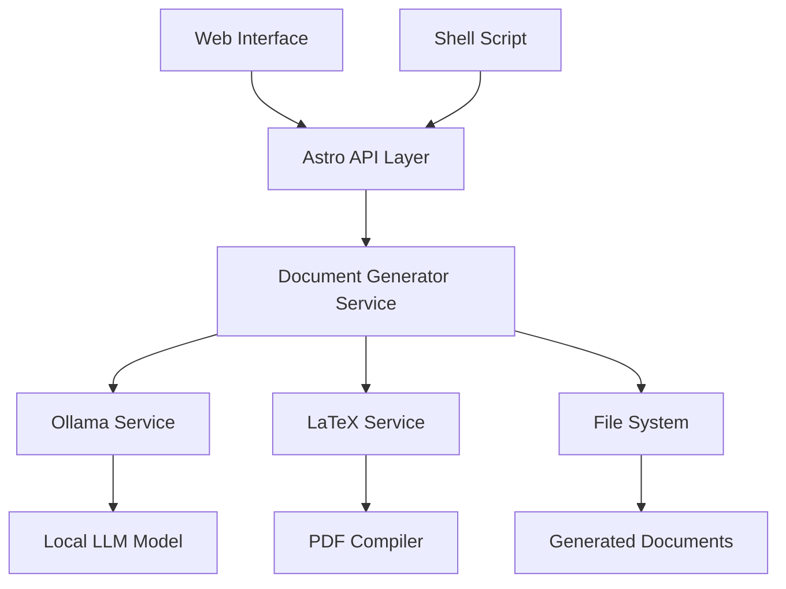
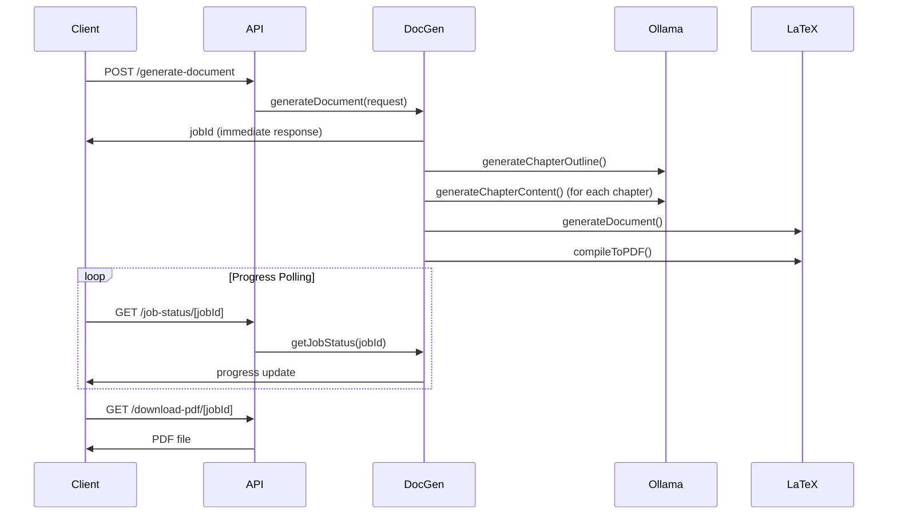

# Architecture & Process Documentation

## 🏗️ System Architecture

### Overview

The Learning Document Generator is a full-stack application that combines AI-powered content generation with professional document compilation. The system is designed with a modular architecture that separates concerns and provides multiple interfaces.

### Component Architecture



## 🔧 Core Services

### DocumentGeneratorService

**Location**: `src/services/documentGenerator.ts`

**Responsibilities**:
- Orchestrates the entire document generation pipeline
- Manages job lifecycle and status tracking
- Coordinates between AI and LaTeX services
- Handles error recovery and fallback mechanisms

**Key Methods**:
- `generateDocument(request)` - Main entry point for document generation
- `getJobStatus(jobId)` - Retrieval of job progress and status
- `processGeneration(job)` - Private method handling the generation pipeline

### OllamaService

**Location**: `src/services/ollama.ts`

**Responsibilities**:
- Interface with local Ollama LLM service
- Generate chapter outlines and content
- Handle AI timeouts and fallbacks
- Context-aware prompt engineering

**Key Features**:
- **Contextual Generation**: Each chapter is generated with awareness of:
  - Previous chapters for continuity
  - Upcoming chapters for preparation
  - Document-wide context and structure
- **Fallback System**: Automatically generates structured content if AI fails
- **Adaptive Prompting**: Adjusts prompts based on complexity level

### LaTeXService

**Location**: `src/services/latex.ts`

**Responsibilities**:
- Generate professional LaTeX documents
- Compile LaTeX to PDF using pdflatex
- Validate LaTeX syntax and structure
- Handle compilation errors and cleanup

**Compilation Process**:
1. Generate LaTeX document with proper formatting
2. First pdflatex pass for initial compilation
3. Second pdflatex pass for cross-references and TOC
4. Cleanup auxiliary files
5. Verify PDF output

## 🔄 Document Generation Pipeline

### Phase 1: Initialization & Validation
```
Input Parameters → Validation → Job Creation → Status: Pending
```

### Phase 2: AI Content Generation
```
Ollama Connection Test → Chapter Outline Generation → Sequential Chapter Content Generation
```

**Chapter Generation Process**:
1. **Outline Creation**: AI generates structured chapter titles
2. **Context Building**: For each chapter:
   - Collect previous chapter summaries
   - Prepare upcoming chapter previews
   - Build complexity-appropriate prompts
3. **Content Generation**: AI generates detailed chapter content
4. **Fallback Handling**: If AI fails, generate structured placeholder content

### Phase 3: Document Assembly & Compilation
```
LaTeX Assembly → Syntax Validation → PDF Compilation → Output Verification
```

## 🌐 API Architecture

### RESTful Endpoints

| Endpoint | Method | Purpose |
|----------|--------|---------|
| `/api/generate-document` | POST | Start document generation |
| `/api/job-status/[jobId]` | GET | Get job progress |
| `/api/download/[jobId]` | GET | Download LaTeX/JSON |
| `/api/download-pdf/[jobId]` | GET | Download compiled PDF |

### Request/Response Flow



## 🎯 AI Content Generation Strategy

### Contextual Prompting

Each chapter is generated with full contextual awareness:

**Context Elements**:
- **Position Context**: Chapter number, total chapters, introductory/middle/final
- **Previous Context**: Summaries of completed chapters
- **Forward Context**: Preview of upcoming chapters
- **Complexity Context**: Beginner, intermediate, or advanced writing style
- **Format Context**: LaTeX formatting requirements

### Prompt Engineering

```typescript
// Example prompt structure
const prompt = `
You are an expert technical writer creating Chapter ${chapterNumber} 
of a comprehensive ${totalChapters}-chapter learning document on "${topic}".

## Chapter Details:
**Title:** ${chapterTitle}
**Position:** Chapter ${chapterNumber} of ${totalChapters}
**Complexity Level:** ${complexity}

## Context & Flow:
${contextualInstructions}

## Writing Instructions:
- **Style:** ${complexityInstructions[complexity]}
- **Format:** Use proper LaTeX formatting throughout
- **Length:** Generate substantial content (2,000-3,000 words equivalent)
// ... additional instructions
`;
```

### Fallback Content Generation

When AI generation fails or times out:

1. **Structured Fallback**: Generate well-organized content with:
   - Clear section headers
   - Bullet points for key concepts
   - Example placeholders
   - Exercise suggestions

2. **Contextual Fallback**: Maintain document flow even with fallback content:
   - Reference previous chapters
   - Prepare for upcoming topics
   - Maintain complexity-appropriate language

## 📄 LaTeX Document Structure

### Document Template

```latex
\documentclass[11pt,a4paper]{article}
\usepackage[utf8]{inputenc}
\usepackage[margin=1in]{geometry}
\usepackage{amsmath,amsfonts,amssymb}
\usepackage{graphicx}
\usepackage{listings}
\usepackage{xcolor}
\usepackage{hyperref}

\title{${topic}}
\author{Learning Document Generator}
\date{\today}

\begin{document}
\maketitle
\tableofcontents
\newpage

${chapterContents.map(content => content).join('\n\n')}

\end{document}
```

### Compilation Process

1. **Two-Pass Compilation**: Required for proper cross-references and table of contents
2. **Error Handling**: Capture and report LaTeX compilation errors
3. **Cleanup**: Remove auxiliary files after successful compilation
4. **Validation**: Verify PDF file exists and has content

## 🔀 Interface Options

### Command Line Interface (CLI)

**Script**: `generate-doc.sh`

**Features**:
- Simple parameter-based interface
- Real-time progress monitoring
- Automatic PDF opening on completion
- Comprehensive error handling
- Help system with examples

**Usage Pattern**:
```bash
./generate-doc.sh "Topic Name" chapters complexity
```

### Web Interface

**Framework**: Astro + Tailwind CSS

**Features**:
- Responsive design for all devices
- Real-time progress updates
- Multiple download options
- Job management and history
- User-friendly error messages

**Components**:
- `DocumentForm.tsx`: Main form interface
- `Layout.astro`: Base layout with navigation
- Progress indicators and status displays

## 🏃‍♂️ Performance Considerations

### Generation Time Factors

1. **AI Response Time**: Varies by model and content complexity
2. **Chapter Count**: Linear scaling with number of chapters
3. **Content Complexity**: Advanced topics take longer to generate
4. **System Resources**: CPU/memory availability affects performance

### Optimization Strategies

1. **Parallel Processing**: Future enhancement for simultaneous chapter generation
2. **Caching**: Store generated outlines and partial content
3. **Progressive Enhancement**: Show partial results as they become available
4. **Resource Management**: Monitor and limit concurrent operations

### Typical Performance Metrics

- **Small Documents (3-4 chapters)**: 2-5 minutes
- **Medium Documents (5-8 chapters)**: 5-15 minutes
- **Large Documents (8+ chapters)**: 10-30 minutes

## 🛡️ Error Handling & Resilience

### Error Categories

1. **Connection Errors**: Ollama service unavailable
2. **Generation Timeouts**: AI taking too long to respond
3. **Compilation Errors**: LaTeX syntax or system issues
4. **System Errors**: File system, permissions, resources

### Recovery Mechanisms

1. **Graceful Degradation**: Fallback content when AI fails
2. **Retry Logic**: Automatic retries for transient failures
3. **Partial Success**: Continue with available content
4. **User Feedback**: Clear error messages and suggested actions

### Monitoring & Logging

- Real-time job status updates
- Detailed error logging
- Performance metrics collection
- System health monitoring

## 🔮 Future Architecture Enhancements

### Planned Improvements

1. **Microservices**: Split services into independent containers
2. **Queue System**: Background job processing with Redis/Bull
3. **Database Integration**: Persistent job storage and user accounts
4. **Template System**: Multiple document templates and themes
5. **Plugin Architecture**: Extensible content generation plugins

### Scalability Considerations

1. **Horizontal Scaling**: Multiple AI service instances
2. **Load Balancing**: Distribute generation load
3. **Caching Layer**: Redis for frequent operations
4. **CDN Integration**: Serve generated documents globally

This architecture provides a solid foundation for AI-powered document generation while maintaining flexibility for future enhancements and scaling requirements.
